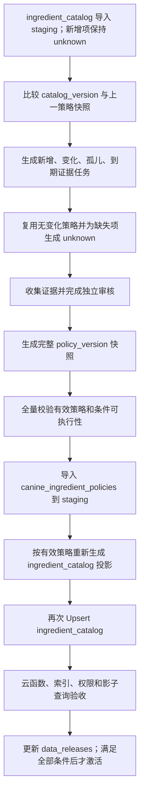

# `canine_ingredient_policies` 持续整理与发布 SOP

## 目的与适用范围

本文是犬食安全策略新增、复核、版本化、导出和发布的唯一标准流程。它适用于：

- 首次为 `ingredient_catalog` 建立犬食安全策略；
- 每次导入新的 `ingredient_catalog` 后进行策略覆盖对账；
- 食材身份、营养形态、证据或产品执行能力变化后的策略复核；
- `canine_ingredient_policies`、`ingredient_catalog` 和 `data_releases` 的 staging 发布与回滚。

每次 `ingredient_catalog` 导入后都必须重新执行策略对账和运行时目录生成，但不要求无变化的旧策略从零人工重审。新增、身份变化、形态变化、证据变化、条件变化和已到复核期限的策略必须进入实质复核；其余策略可以带来源版本地延续到新策略快照。

本文不是兽医诊疗指南。产品中的策略用于阻止明显风险、控制食材选择和提供一般性提示，不能替代个体化兽医诊断或中毒处置。

## 强制原则

1. **目录先于策略**：策略只能引用已发布在目标 `catalog_version` 中的稳定 `concept_id` 或 `variant_id`。
2. **默认显式未知**：没有有效策略的对象一律按 `unknown` 处理，不把“证据不足”描述成安全结论；运行时资格统一由 `ingredientOperationRules/v1` 判断。
3. **完整快照**：每个 `policy_version` 包含目标目录所需的全部有效策略，不只保存本批新增项。
4. **版本独立**：`catalog_version` 表示食材身份快照，`policy_version` 表示犬食安全结论快照，两者不能共用版本号或互相覆盖。
5. **身份与安全分离**：目录中的名称、分类和 USDA 营养来源不能自动推导 `allowed`。
6. **证据可追溯**：每个非 `unknown` 结论必须记录具体证据、适用对象、访问日期、审核人和判断理由。
7. **条件必须可追溯**：产品无法稳定验证或强制执行的条件仍需保留为 `conditional`，不能依靠提示文案把它描述成无条件安全。
8. **形态例外最小化**：只有生熟、带骨、罐装、调味等形态差异确实改变风险时才建立形态级策略。
9. **双人/双轮复核**：制作者与批准者必须分离，或至少保留独立审核轮次和差异记录。
10. **先 staging 后激活**：策略导入、目录反向投影和云函数校验全部通过前，不得切换活动版本。

## 术语与决策语义

### 策略对象

- **概念级策略**：适用于某个 `concept_id` 的默认犬食安全判断。
- **形态级策略**：只适用于某个 `variant_id`，处理生熟、骨头、皮、盐、油或加工状态造成的差异。
- **有效策略**：对某个目录项最终生效的策略。先查形态级策略，没有时继承概念级策略，再没有时为 `unknown`。

### 决策值

| `decision` | 含义 | 默认产品行为 |
| --- | --- | --- |
| `allowed` | 在策略明确限定的普通使用场景下，没有识别到需要阻止选择的食材级风险 | 可进入选择候选，但仍受营养配比和云函数校验约束 |
| `conditional` | 存在明确使用条件 | 可进入搜索、添加和自动带入；必须保留条件事实 |
| `blocked` | 不应进入狗饭食谱选择链路 | 不可选择；人饭菜谱映射时自动拦截 |
| `unknown` | 证据不足、对象不明确或尚未复核 | 可进入搜索、添加和自动带入，但不得制造安全结论 |

`allowed` 不表示“可以无限量食用”“营养均衡”或“适合所有犬只”。营养供给量由配方计算负责，过敏、疾病、药物和个体耐受由其他规则或兽医判断负责。

## 概念与形态策略优先级

有效策略按以下顺序解析：

```text
当前 policy_version 下的形态级策略
→ 当前 policy_version 下的概念级策略
→ unknown（系统生成的保守默认）
```

形态级策略必须遵守：

- 概念为 `allowed` 时，形态可以收紧为 `conditional` 或 `blocked`。
- 概念为 `conditional` 时，形态只有在条件已经由该形态天然满足且证据明确时，才可放宽为 `allowed`。
- 概念为 `unknown` 时，形态可以基于只适用于该具体形态的充分证据作出结论。
- 概念为 `blocked` 时，形态不得由普通审核直接放宽；确需例外必须有兽医毒理级证据、独立批准和明确变更记录。
- 形态策略的 `concept_id` 必须与目录中的所属概念一致。

## 证据标准

### 来源优先级

按以下顺序优先使用：

1. 政府兽医监管或公共卫生机构，例如 FDA Center for Veterinary Medicine；
2. 兽医毒物控制中心和权威兽医手册，例如 ASPCA Animal Poison Control Center、Merck Veterinary Manual；
3. 同行评审的兽医毒理、临床营养研究或系统综述；
4. 兽医学院或专业兽医组织的公开指南；
5. 其他来源只能生成待审核候选，不能单独支持 `allowed` 或推翻 `blocked`。

基础参考入口：

- [FDA：Potentially Dangerous Items for Your Pet](https://www.fda.gov/animal-veterinary/animal-health-literacy/potentially-dangerous-items-your-pet)
- [FDA：Xylitol is Toxic to Dogs](https://www.fda.gov/animal-veterinary/animal-health-literacy/paws-xylitol-toxic-dogs)
- [ASPCA：People Foods to Avoid Feeding Your Pets](https://www.aspca.org/pet-care/aspca-poison-control/people-foods-avoid-feeding-your-pets)
- [Merck Veterinary Manual：Food Hazards](https://www.merckvetmanual.com/special-pet-topics/poisoning/food-hazards)

这些入口不是永久结论清单。每条策略必须保存实际使用的页面或论文，而不能只写“来自 FDA/ASPCA”。

### 每条策略必须记录

- 证据标题、发布机构和 URL/文献标识；
- 证据访问日期或出版日期；
- 明确适用于犬，而不是把其他物种结论直接外推；
- 证据针对的食材部位、形态、剂量或暴露方式；
- 支持当前结论的简短判断理由；
- 证据冲突、不确定性和限制；
- 制作者、复核者、批准时间和下次复核时间。

论坛、营销文章、大模型回答、无出处转载和单一用户经验不得作为正式策略证据。

## 条件模型

`conditional` 的条件必须结构化，不能只写自然语言备注。至少区分：

| 条件类型 | 示例 | 运行时处理 |
| --- | --- | --- |
| 形态固有条件 | 必须熟制、必须去骨、必须无调味 | 保留条件事实，状态仍为 `conditional` |
| 配方用量条件 | 不超过配方或体重对应上限 | 保留结构化阈值，交由后续云端校验 |
| 犬只属性条件 | 年龄、体重、妊娠或特定阶段 | 不生成个体安全结论 |
| 疾病/药物条件 | 胰腺炎、肾病、处方药相互作用 | 不生成个体安全结论 |
| 个体耐受条件 | 乳糖不耐、过敏史 | 不生成个体安全结论 |

条件中涉及克数、体重比例、频率或营养阈值时，必须保存单位、基准、比较符和证据，禁止只写“少量”“适量”。无法量化或执行时保留 `conditional`，不得升级为 `allowed`。

## 版本和种子文件

策略使用不可变完整快照：

```text
data/canine-ingredient-policies/releases/<policy_version>.json
```

建议版本格式：

```text
YYYY-MM-DD-vN
```

策略快照必须声明：

```text
policy_version
compatible_catalog_version
evidence_reviewed_at
items[]
```

策略主体保持稳定，云端文档 ID 必须包含 `policy_version` 或使用等价的版本隔离键，不能覆盖旧策略版本。活动发布记录同时指向 `catalog_version` 和 `policy_version`，回滚通过切换版本指针完成。

## 每次目录导入后的强制对账

每次 `ingredient_catalog` 导入 staging 后，必须生成目录与上一策略快照的差异报告：

| 目录变化 | 策略动作 |
| --- | --- |
| 新增 `concept_id` | 新建概念策略审核任务；完成前生成 `unknown` |
| 新增 `variant_id` | 判断是否继承概念策略；存在形态风险时建立形态策略 |
| 仅名称、alias、排序变化 | 策略可延续，但仍校验引用和目录版本 |
| 分类变化 | 进入影响复核，禁止仅因新分类自动改变结论 |
| 生熟、部位、骨皮或加工状态变化 | 强制重新审核相关形态策略 |
| USDA `foodId` 变化但食材身份不变 | 复核形态描述是否改变安全条件；不自动改结论 |
| 概念拆分、合并或换 ID | 阻断发布，先处理策略迁移和旧引用下线 |
| 目录项下线 | 生成策略墓碑或停止参与新版本；不得直接删除历史策略 |
| 证据更新、撤回或冲突 | 强制重新审核所有受影响策略 |

对账必须输出：

- 目录概念数和形态数；
- 已覆盖、继承、待复核、`unknown`、孤儿策略和冲突数量；
- 新增/变化对象列表；
- 到期证据列表；
- 是否满足发布门槛。

## 标准流程



### 1. 建立策略批次

- 创建新的 `policy_version`，声明兼容的 `catalog_version`。
- 复制上一版完整策略快照，旧文件保持不可变。
- 运行目录差异和策略覆盖对账。
- 为新增、变化、到期、冲突和孤儿策略生成审核任务。

### 2. 初审

- 确认策略对象是概念还是具体形态。
- 检查证据是否明确适用于犬及当前食材形态。
- 选择 `allowed`、`conditional`、`blocked` 或 `unknown`。
- 为 `conditional` 编写结构化条件并确认产品是否能够执行。
- 无法确认时保留 `unknown`，不能为了提高可选率放宽。

### 3. 独立复核

- 复核对象身份、结论、证据、条件和用户文案。
- `blocked`、从严转宽、证据冲突和毒理相关策略必须重点复核。
- 记录初审与复核差异；不能只填写审核人姓名而无结论。
- 批准后才进入完整策略快照。

### 4. 发布前全量校验

必须全部满足：

- `policy_version` 和 `compatible_catalog_version` 唯一明确；
- 目标目录的每个概念都有概念策略或明确 `unknown`；
- 每个形态都能解析出唯一有效策略；
- 不存在引用目录外概念/形态的孤儿策略；
- 形态策略与所属概念一致，覆盖关系符合优先级规则；
- 非 `unknown` 策略具有完整证据和独立审核记录；
- `conditional` 条件通过 Schema 校验，单位和执行方明确；
- 无法由产品执行的条件不会被升级为 `allowed`；
- `blocked` 目录项不可操作，`allowed`、`conditional`、`unknown` 统一按非 blocked 规则处理；
- 旧策略版本和导出包仍可用于回滚。

### 5. staging 发布顺序

严格按下列顺序：

```text
1. 导入新的 ingredient_catalog（全部新增项先保持 fail-closed）
2. 运行策略覆盖对账和审核
3. 导入 canine_ingredient_policies
4. 用有效策略重新生成 ingredient_catalog
5. 再次导入 ingredient_catalog，更新 policy_status
6. 运行云函数二次校验和影子查询
7. 更新 data_releases 中的集合计数和兼容版本
8. 所有依赖完成后才切换活动版本
```

策略集合只允许受控导入工具写入。客户端不得直接读取或写入原始审核字段；小程序搜索读取已反规范化的目录状态，保存配方时由云函数重新读取当前有效策略进行校验。

### 6. 云端验收

- 按 `policy_version` 核对策略行数，不能只比较集合历史总数。
- 抽检 `allowed`、`conditional`、`blocked` 和 `unknown` 各类样本。
- 抽检概念继承、形态收紧和形态放宽场景。
- 核对目录的 `policy_status` 与有效策略一致，且新生成物不再携带权限布尔字段。
- 验证客户端伪造 `conceptId`、`variantId`、`foodId` 或旧策略版本时被云函数拒绝。
- 验证活动版本切换失败时仍保持上一完整版本可用。

## 发布门槛

### 允许导入 staging

- 可以包含 `unknown`，但不得把未知状态描述为安全结论；
- 对账报告、完整快照、manifest 和审核记录齐全；
- 所有引用、版本和条件 Schema 校验通过。

### 允许激活生产

- 所有对用户可搜索或可映射的目录项都有唯一有效策略；
- `blocked` 在搜索、添加、自动带入和保存链路均被拒绝；
- 云函数保存校验、权限和索引已经启用；
- 目录、策略和发布记录的版本组合经过影子查询；
- 旧版本可通过版本指针回滚。

## 下线与回滚

- 策略结论变化必须创建新 `policy_version`，不能覆盖历史快照。
- 发现严重安全问题时，先发布更严格的新策略并立即将相关目录项标记为 `blocked`，再补充完整证据和说明。
- 概念或形态下线时保留历史策略引用，使用墓碑或版本隔离停止其参与新目录。
- 回滚同时切换兼容的 `catalog_version` 和 `policy_version`；不能只回滚其中一个。
- 回滚后重新验证目录选择状态和云函数保存校验。

## 当前实现状态与剩余阻断项

首个 staging 策略版本已经完成：

- SQLite 支持兼容目录版本、结构化证据、判断理由、审核状态、复核期限和条件；
- 策略按“对象 + `policy_version`”隔离，完整快照可并存；
- 种子器生成概念全覆盖的保守默认，校验孤儿引用、形态覆盖和版本兼容；
- 导出包包含策略 manifest，导入器按 `policy_version` 核对数量；
- `ingredient_catalog` 已按有效策略生成 `policy_status`，新生成物不再生成权限布尔字段；
- `data_releases` 已记录兼容的 `catalog_version` 和 `policy_version`。

生产激活前仍须完成：

1. 为后续策略版本实现与上一版本的自动差异报告、证据到期报告和迁移清单。
2. 由具备相应资质的兽医或犬类临床营养专业人员终审本轮可放宽策略；当前审核记录明确为非兽医双轮证据复核。
3. 实现云函数保存配方时的策略二次校验，并拒绝旧版本或客户端伪造的目录/策略引用。
4. 限制客户端直接访问 `canine_ingredient_policies` 的完整证据和审核字段。
5. 为策略和目录查询建立索引，完成影子查询和版本组合回滚验证。
6. 在小程序采集并可靠验证最终烹饪状态前，需要熟制的形态继续保持 `conditional`，不得升级为 `allowed`。

这些阻断项完成前，策略版本只能保留在 staging，不能切换为生产活动版本。

## 批次记录模板

```text
policy_version:
compatible_catalog_version:
制作者:
独立复核者/复核轮次:
目录概念数 / 形态数:
继承策略数:
新增审核数:
变化复核数:
allowed / conditional / blocked / unknown:
孤儿策略数:
到期证据数:
条件 Schema 校验:
目录反向投影校验:
云端抽检样本:
遗留风险:
```

## 完成定义

一个策略批次只有同时满足以下条件才算完成：

- 完整、不可变的策略快照和证据记录已保存；
- 目录差异、覆盖率、孤儿引用和证据期限对账完成；
- 新增与受影响策略经过独立复核；
- 每个目录形态能解析出唯一有效策略；
- 全量自动校验和 staging 导入通过；
- `ingredient_catalog` 已按有效策略重新生成并复验；
- 云函数、权限、索引和影子查询通过；
- 工作日志记录版本、数量、证据日期、测试和剩余风险；
- 如要激活生产，目录版本与策略版本作为一个兼容组合发布并可回滚。
