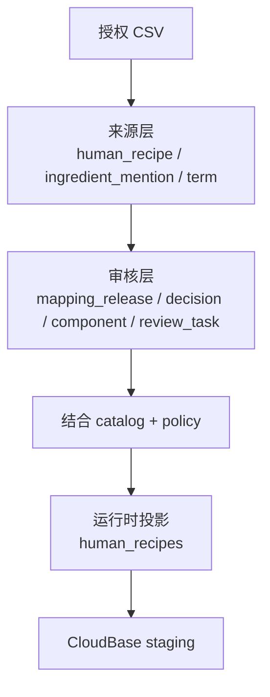

# `human_recipes` 映射与发布 SOP

## 目的

本文规定授权菜谱来源的导入、原料写法映射、犬食安全过滤、运行时投影、CloudBase staging 发布和后续增量维护流程。

人饭菜谱只提供“食材灵感”。来源分量只保留用于展示，不能直接成为狗饭用量；用户最终选择的食材和克数必须由狗饭配方流程重新确认和计算。

## 强制原则

1. **授权先于发布**：来源必须具有版本化授权声明，并校验实际文件 SHA-256。
2. **保留来源原文**：菜谱标题、分类、原料名、分量和原始位置不能因标准化而丢失。
3. **写法映射复用**：映射针对规范化原料写法维护，不对34万次原料出现逐条人工处理。
4. **精确优先**：只有目录中唯一标准名称或由确定性概念发现规则生成的高置信别名可以自动通过；编辑距离、向量和大模型结果不能直接发布。
5. **未知不冒充安全结论**：未匹配和歧义项只保留来源文字；已映射组件按策略四态展示。
6. **映射与安全分离**：原料成功映射不等于适合犬只；必须再解析当前犬食策略。
7. **完整映射快照**：每个 `mapping_version` 对全部规范化写法给出明确结论，不能用缺行表示未知。
8. **只发布可操作菜谱**：运行时 `human_recipes` 只包含至少一个已映射且为 `allowed` 的组件。
9. **分量只作参考**：所有来源分量必须带 `amount_is_reference_only=true`。
10. **先 staging 后激活**：导入、版本计数、阻断样本和查询链路全部通过前不得激活。
11. **低 token 清洗**：先执行确定性清洗，调味料和油不进入覆盖统计或模型队列；模型只处理达到频次阈值、按清洗后身份聚合的剩余项。

## 三层数据



### 来源层

- `human_recipe`：菜谱原文、分类、标题和原料/分量对齐状态。
- `human_recipe_ingredient_mention`：按原始位置拆出的原料和分量。
- `recipe_ingredient_term`：相同规范化写法及出现频次。

### 审核层

- `recipe_mapping_release`：映射版本、兼容目录/策略、来源 SHA-256 和授权状态。
- `ingredient_mapping_decision`：`matched`、`composite`、`alternative`、`ambiguous` 或 `unmatched`。
- `ingredient_mapping_component`：一个写法对应的一个或多个概念/形态。
- `review_task`：需要人工处理的高频未匹配、歧义、复合和安全关键项。

### 运行时层

CloudBase `human_recipes` 一菜谱一文档，内嵌原料提及、映射组件、策略状态和选择状态。离线审核表不上传。

## 标准流程

### 1. 记录来源授权

授权声明保存在：

```text
data/human-recipes/sources/<source>.json
```

必须包含来源版本、实际文件 SHA-256、`license_status=verified`、确认依据、确认人和确认日期。合同或敏感凭证不进入代码库，但由项目所有者保管。

### 2. 构建来源数据

使用 `build_ingredient_data_sqlite.py` 导入 CSV。`yl` 和 `fl` 按 `#` 的原始位置对应，字段内换行必须由 CSV 解析器处理。原料和分量数量不一致时保留记录并标注状态，不静默移动分量。

### 3. 生成映射快照

生成映射前先运行低 token 清洗：

```bash
python3 scripts/fooddata/prepare_recipe_ingredient_model_batches.py \
  --sqlite fooddata-cloudbase-export/<batch>/ingredient_data.sqlite \
  --min-model-occurrences 5 \
  --max-model-terms 5000 \
  --batch-size 50 \
  --report fooddata-cloudbase-export/<batch>/normalization-report.json \
  --model-batches fooddata-cloudbase-export/<batch>/model-batches.jsonl
```

确定性规则负责字符、数量、用途括号、受控品牌、刀工、生熟、同义词、组合和替代；水、酵母、泡打粉等进入烹饪辅料分流。模型批次按 `cleaned_name` 聚合，最多附带5个高频来源写法；模型输出不能直接写入映射表，必须再次通过目录别名、来源身份和唯一营养来源约束。

```bash
python3 scripts/fooddata/seed_recipe_ingredient_mappings.py \
  --sqlite fooddata-cloudbase-export/<batch>/ingredient_data.sqlite \
  --mapping data/human-recipes/mappings/<mapping_version>.json
```

首版自动规则只有 `approved_alias_exact`。后续目录批次先运行自动概念发现；复合、歧义和未匹配项不得携带可发布组件，并可长期保持隔离，不要求人工逐条清空。

映射生成器会：

- 校验目录、策略和来源授权版本；
- 更新来源授权状态；
- 为全部原料写法生成完整决策；
- 复用目录中每个概念唯一的烹调基准营养来源；
- 为达到频次阈值的未匹配写法生成审核任务；
- 输出写法覆盖率和出现次数覆盖率。

### 4. 生成运行时投影

导出器将每次原料提及与映射组件连接，再解析形态级优先、概念级回退的有效犬食策略。只有至少一个已映射且为 `allowed` 的组件进入 `human_recipes.jsonl`。

每条文档必须包含：

- 独立的 `recipe_version` 与输入 `mapping_version`；v2 的
  `recipe_version=human-recipe-runtime-v2-<mapping_version>`，不得复用历史
  v1 版本；
- 兼容 `catalog_version` / `policy_version`；
- 来源版本和授权状态；
- 标题、分类、搜索文本；
- 原料原文、规范化写法和来源分量；
- 映射状态及组件的 `concept_id`、`variant_id`、`food_id`；
- `policy_status`，以及仅对 `blocked` 组件整理后的 `blockedReason`；
- 映射、未解决、可操作和阻断数量；报告字段 `nonBlockedComponents` 按 `notBlocked` 操作规则计数；
- `amounts_are_reference_only=true`。

### 5. 发布前校验

必须全部满足：

- 来源授权为 `verified`，SHA-256 与实际 CSV 一致；
- `recipe_ingredient_term` 与映射决策数量完全一致；
- 所有组件引用当前目录的合法概念和形态；
- 所有映射组件引用当前有效策略；
- 只有 `allowed` 可操作；`conditional`、`unknown` 和 `blocked` 均不生成可操作组件；
- 运行时文档至少具有一个已映射且为 `allowed` 的组件；
- 人饭分量全部标记为仅供参考；
- `_id` 唯一，文档低于512 KiB；
- v2 `_id`、`recipe_version`、运行时 `release_id` 和 `data_releases._id`
  均不得与历史 v1 键空间重叠；
- staging 报告和 `data_releases.rollback_candidate` 明确记录切换前的
  active `recipe_version`；
- SQLite 完整性和外键检查通过；
- 抽检允许、阻断、未匹配和分量错位样本。

### 6. CloudBase staging 导入

```bash
python3 scripts/fooddata/import_ingredient_cloudbase.py \
  --package-dir fooddata-cloudbase-export/<batch>/cloudbase-jsonl \
  --env-id <env-id> \
  --tcb-bin <tcb> \
  --collection human_recipes \
  --collection data_releases
```

严格先导入 `human_recipes`，按 `recipe_version` 校验数量，再更新 `data_releases`。正常查询必须带活动 `recipe_version`，客户端不能写入该集合。
导入 staging 只允许新增 v2 键；不得用历史 v1 `_id` 做 Upsert，也不得在
验收过程中切换 active。只有显式发布动作才能把指针从回滚候选切到新版本。

## 后续增量维护

新增菜谱来源或目录版本时不重新人工审核全部菜谱：

1. 重建来源层并比较新增原料写法；
2. 自动复用未变化的映射决定；
3. 只审核新增、歧义、复合、安全关键和受目录拆并影响的写法；
4. 生成新的完整 `mapping_version`；
5. 自动重新计算策略状态和可发布菜谱；
6. 导入新版本并通过发布指针切换。

模型候选优先级按聚合后的 `occurrence_count` 排序。调味料和油直接排除，复合食品和明显危险食材单独分流；提高覆盖率不能以放宽身份匹配或安全策略为代价。频次低于阈值的长尾项可以保持延后，不要求人工逐条清空。

## 当前基线

- 来源菜谱：50,000条；
- 原料提及：340,791次；
- 规范化写法：33,930种；
- 精确匹配写法：128种；
- 已映射出现次数：41,117次，覆盖率12.07%；
- 待审核高频写法：983种；
- 历史 v1 至少有一个旧版安全可选组件的运行时菜谱：6,082条；该历史快照不就地改写。

`mapping_version=2026-07-23-v1` 是当前映射输入；历史
`recipe_version=2026-07-23-v1` 快照保持不变。新 v2 运行时投影使用独立
`recipe_version` 和文档 ID，后续通过审核高频原料写法和扩展标准食材目录逐步增加可用菜谱。
