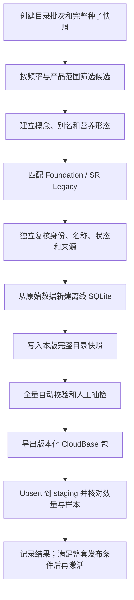

# `ingredient_catalog` 持续填充 SOP

## 目的与适用范围

本文是后续新增、修正和下线食材目录项的唯一标准流程。首批目录只是基线，不代表后续可以直接向 SQLite 或 CloudBase 追加记录。

每个目录批次都必须重复执行：候选筛选、概念建模、营养形态映射、独立复核、全量快照构建、自动校验、导出、staging 导入和云端抽检。已经稳定的规则和旧目录项不需要逐条重新人工判断，但必须随新快照一起通过全量校验。

本文只负责食材身份、中文名称、分类、别名和 USDA 营养来源。犬食安全结论由 `canine_ingredient_policies` 单独审核和发布；进入目录不等于允许犬只食用。

每次目录导入 staging 后，必须继续执行 [`canine_ingredient_policies` 持续整理与发布 SOP](canine-ingredient-policies-sop.md) 的覆盖对账。新增目录项先保持 `policy_status=unknown`，安全策略完成后再反向生成唯一 `policy_status`；新生成物不保存权限布尔字段。

## 强制原则

1. **完整快照，不用增量补丁**：每个 `catalog_version` 都保存全部有效概念、别名和形态，不能只保存本批新增项。
2. **旧版本不可改**：已导入 staging 或生产的种子和导出包必须保留；下一批从上一版复制出新文件再修改。
3. **稳定 ID 不复用**：`concept_id` 和 `variant_id` 发布后不能因改名而改变，也不能重新分配给另一种食材。
4. **原始数据不手改**：Foundation 和 SR Legacy 只作为来源；产品中文名、分类和别名只写入目录种子。
5. **安全策略分离**：目录审核完成时仍可保持 `policy_status=unknown`，不在目录审核阶段猜测 `allowed`。
6. **双人/双轮复核**：制作者不能把自己的候选直接视为已复核；至少需要另一个人或独立审核轮次确认身份、状态和来源。
7. **只从版本化种子发布**：禁止只在 SQLite 或云控制台手工新增、改名或删除目录项。
8. **先 staging，后激活**：任何目录批次都不得由导入脚本自动切换活动版本。

## 数据与版本边界

| 对象 | 含义 | 版本规则 |
| --- | --- | --- |
| `data_releases` | 一整套云端数据投影的发布状态和集合数量 | 营养底库或整套发布发生变化时更新 |
| `catalog_version` | `ingredient_catalog` 内容快照版本 | 每次目录内容变化都递增，格式 `YYYY-MM-DD-vN` |
| `ingredient_concept` | 用户认知中的标准食材身份 | 身份不变时保留 `concept_id` |
| `ingredient_variant` | 具有明确生熟、部位或加工状态的营养形态 | 形态语义不变时保留 `variant_id` |
| `foodId` | 某个 USDA 来源版本中的营养记录 | 不是产品身份，不用于代替概念或形态 ID |

当前基线是 `data/ingredient-catalog/initial-v1.json`。从下一批开始，种子文件使用：

```text
data/ingredient-catalog/releases/<catalog_version>.json
```

每个文件都是完整快照。构建产物和导出包使用同一个 `catalog_version` 命名，避免把不同批次混在同一目录中。

## 是否新增概念或形态

| 情况 | 操作 | 示例 |
| --- | --- | --- |
| 普通食材身份不同 | 新建 `concept_id` | 猪心与猪肝 |
| 同一食材仅生熟或处理状态不同 | 在原概念下新建 `variant_id` | 猪心（生）与猪心（炖熟） |
| 只是同义称呼 | 新增 alias，不建概念或形态 | 西红柿 → 番茄 |
| 只是展示文案修正 | 保留 ID，修正名称并记录原因 | 炖煮熟制 → 炖熟 |
| 原条目把两种身份错误合并 | 新建正确 ID，旧 ID进入下线流程 | “瘦肉”错误绑定到特定动物 |
| 更换等价且更可靠的 USDA 记录 | 保留形态 ID，经复核后更新来源引用 | 同一生鲜形态替换来源记录 |

短词、上位词和不确定词不能自动绑定。例如“肉末”“青菜”“鱼”只能进入待审核候选，不能为了提高匹配率强行归入某个概念。

## 命名、分类和别名规则

### 中文名称

- `canonical_name` 使用普通、稳定的食材名称，不携带生熟状态，例如“猪心”。
- `display_name` 必须包含影响营养选择的状态，例如“猪心（生）”“猪心（炖熟）”。
- 不把切丝、切丁、品牌、新鲜等不影响营养身份的描述写入形态名。
- 生、熟、干制、罐装、去皮、带皮、具体部位等可能影响营养的词不得随意删除。

### 别名

- alias 只收录真实同义词和经过复核的来源写法。
- alias 必须指向概念，不能直接指向某个 `foodId`。
- 同一个规范化 alias 若指向多个概念，必须标记为歧义并阻止自动发布。
- 上位词、下位词、组合原料和错别字推测不能作为已审核 alias。

### 分类

现有一级分类受控词为：`carb`、`dairy`、`egg`、`fish`、`fruit`、`legume`、`meat`、`oil`、`organ`、`seafood`、`vegetable`。其中 `dairy` 只表达奶制品身份，不代表犬食安全结论。

新增一级分类必须先更新领域词汇和校验规则，不能在种子中临时创造近义分类。二级分类应复用已有词；确需新增时，在批次变更记录中说明边界和至少一个示例。

## USDA 营养来源选择规则

1. 先确定食材身份和形态，再选择来源记录，不能反向把每条 USDA 记录都暴露成产品食材。
2. 来源描述必须与动物/植物种类、部位、生熟和加工状态一致。
3. 同等适配时优先 Foundation；Foundation 缺失覆盖时使用 SR Legacy。
4. 候选来源必须存在营养明细，且种子中的 `description_contains` 必须能校验英文描述。
5. 不以营养值“看起来更合理”为由覆盖来源原值，也不把未知值当作零。
6. 更换已发布形态的来源记录时，必须记录旧、新来源及原因，并重新抽检关键营养素。

## 标准流程



### 1. 建立批次

- 确定新的 `catalog_version`。
- 复制上一版完整种子到新文件，旧文件保持不变。
- 写明本批范围：新增概念、形态、别名、修正项和拟下线项。
- 保存候选来源、选择理由和审核人/审核轮次。

### 2. 建模和复核

- 先按“新增概念还是新增形态”决策表建模。
- 对中文名、别名、一级/二级分类和默认形态逐项复核。
- 对 USDA 英文描述、来源版本、`fdc_id`、状态及营养明细逐项复核。
- 每个概念恰好一个默认形态；若无法确定默认形态，不发布该概念。
- 安全状态未审核时保持 `unknown`，不在目录审核阶段猜测 `allowed`。

### 3. 从原始来源重新构建

下一批不得把新种子直接写进上一批已经人工处理的 SQLite。必须从 Foundation、SR Legacy 和菜谱原始输入构建一个新的 SQLite 路径，再只写入本版完整种子。这样可以避免上一版已删除 alias 或形态残留在数据库中。

```bash
python3 scripts/fooddata/build_ingredient_data_sqlite.py \
  --foundation-sqlite <foundation.sqlite> \
  --sr-legacy-dir <sr-legacy-dir> \
  --recipes-csv <recipes.csv> \
  --out-sqlite fooddata-cloudbase-export/<catalog_version>/ingredient_data.sqlite \
  --release-id <data_release_id>

python3 scripts/fooddata/seed_ingredient_catalog.py \
  --sqlite fooddata-cloudbase-export/<catalog_version>/ingredient_data.sqlite \
  --seed data/ingredient-catalog/releases/<catalog_version>.json
```

如果营养底库未变化，`data_release_id` 可以保持不变；目录变化由 `catalog_version` 表达，不需要重复上传全部 `food_nutrition_profiles`。

### 4. 发布前校验

以下检查全部通过才允许导出：

- SQLite `integrity_check = ok` 且外键错误为 0。
- `concept_id`、`variant_id` 唯一，来源版本与 `fdc_id` 的组合不重复。
- 每个概念恰好一个默认形态。
- alias 规范化后不存在跨概念冲突。
- 一级分类全部来自受控词表。
- 每个形态的英文描述匹配且至少有一条营养记录。
- 全部目录项均有 `catalog_version`，且本次导出只有一个版本。
- 未审核安全策略的目录项保持 `policy_status=unknown`，并且新投影不生成权限布尔字段。
- 对新增和修改项做 100% 人工抽检；对未改旧项做固定比例回归抽检。

至少运行：

```bash
node --test tests/ingredient-data-sqlite-build.test.js

sqlite3 -readonly fooddata-cloudbase-export/<catalog_version>/ingredient_data.sqlite \
  "PRAGMA integrity_check; SELECT COUNT(*) FROM pragma_foreign_key_check;"
```

### 5. 导出和 staging 导入

```bash
python3 scripts/fooddata/export_ingredient_cloudbase.py \
  --sqlite fooddata-cloudbase-export/<catalog_version>/ingredient_data.sqlite \
  --out-dir fooddata-cloudbase-export/<catalog_version>/cloudbase-jsonl

python3 scripts/fooddata/import_ingredient_cloudbase.py \
  --package-dir fooddata-cloudbase-export/<catalog_version>/cloudbase-jsonl \
  --env-id <staging-env-id> \
  --tcb-bin <tcb-path> \
  --collection ingredient_catalog
```

目录单独更新时只导入 `ingredient_catalog`；不重复导入未变化的 `food_nutrition_profiles`。只有整套发布元数据需要同步时才更新 `data_releases`，且它仍保持 `staging`，直到所有依赖集合和查询路径验收完成。

### 6. 云端验收

- 云端总数与 manifest 一致。
- 新增、修改和默认形态各抽检至少一个样本。
- 分别抽检 Foundation 与 SR Legacy 来源。
- 核对 `_id`、`conceptId`、`variantId`、`foodId`、`catalog_version` 和选择状态。
- 搜索验证标准名与 alias；歧义 alias 不得静默返回唯一结果。
- 在工作日志记录批次、数量、测试、云环境和未解决风险。

## 变更审核记录模板

每批在 PR/任务说明或相邻审核文件中保留下列信息：

```text
catalog_version:
制作者:
复核者/独立复核轮次:
新增概念数:
新增形态数:
新增别名数:
修正项:
拟下线项:
Foundation / SR Legacy 数量:
自动校验结果:
云端抽检样本:
遗留风险:
```

## 下线、换 ID 与回滚

### 当前允许

- 新增概念、形态和 alias。
- 在身份不变时保留稳定 ID，修正名称、分类、排序或来源映射。
- 使用上一版完整种子和导出包重新 Upsert，回滚同 ID 文档内容。

### 当前阻断

当前导出器会排除 `deprecated` 项，而云端导入器只做 Upsert、不删除旧文档。因此，直接从新快照删除条目或更换 ID，会造成云端残留，且集合总数校验失败。

在实现并测试“墓碑文档或受控清理 + manifest 校验 + 回滚”之前：

- 不得删除已经导入云端的 `concept_id` 或 `variant_id`。
- 不得用新 ID 替换旧 ID 后直接发布。
- 不得把 `deprecated` 仅保留在本地而期待云端自动下线。
- 遇到错误合并、身份拆分或必须下线时，停止发布并先补齐下线机制。

## 完成定义

一个目录批次只有同时满足以下条件才算完成：

- 完整、不可变的版本化种子已保存。
- 建模与 USDA 来源经过独立复核并留有记录。
- 新建 SQLite 和全部自动校验通过。
- CloudBase 包具有 manifest、行数和 SHA-256 校验。
- staging 导入、总数核对和代表性样本抽检通过。
- 工作日志已更新，已知限制明确记录。
- 如要激活生产版本，犬食安全策略、索引和小程序查询链路另行通过发布验收。
