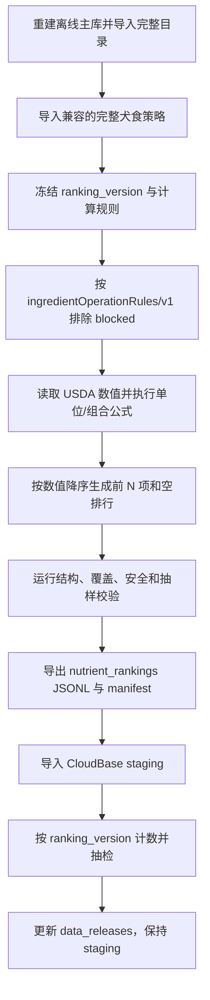

# `nutrient_rankings` 生成与发布 SOP

## 目的与适用范围

本文是营养素食材排行规则维护、离线生成、校验和 CloudBase staging 发布的标准流程。每次发生以下任一变化时，都必须重新生成完整排行快照：

- `catalog_version` 变化；
- `policy_version` 或任一目录项的 `policy_status` 变化；
- USDA 食物来源、营养值或营养素 ID 映射变化；
- 排行公式、单位换算、组合营养素或最大返回数量变化；
- 营养评估标准新增、删除或更名 `nutrient_code`。

排行用于回答“当前 allowed 食材中，哪些食材每 100 克含某营养素较多”，不是喂食量建议，也不表示排行靠前的食材适合无限添加。

## 强制原则

1. **目录和策略先于排行**：排行只能引用已审核目录形态，并解析目标策略版本的有效结论。
2. **统一 not-blocked 候选**：`allowed`、`conditional`、`unknown` 可进入排行；只有 `blocked` 排除。
3. **禁止 blocked 回退**：没有合格候选时生成空排行，不能回退到 `blocked`。
4. **统一比较基准**：当前统一按每 100 克可食部分湿重值排序，不与干物质、每千卡或每日需要量混排。
5. **单位先归一再排序**：同一 `nutrient_code` 的候选必须转换到规则声明的统一单位。
6. **组合值要求完整**：EPA+DHA、蛋氨酸+胱氨酸等组合营养素只有在所有组成值均已知时才计算；缺一项不把缺失值当零。
7. **替代来源有优先级**：维生素 D 等存在多个 USDA 表示时，按公式顺序选择第一套完整来源，不能重复相加。
8. **版本不可混用**：每个 `ranking_version` 必须声明唯一兼容的 `catalog_version` 和 `policy_version`。
9. **完整快照**：每版包含营养评估可能请求的全部 `nutrient_code`，包括当前为空的排行。
10. **先 staging 后激活**：排行导入、抽样和客户端/云函数契约验证完成前不得激活发布。

## 数据模型

离线主库使用两张表：

- `nutrient_ranking`：每个营养素的版本、兼容版本、单位、公式、候选数和排行项数；
- `nutrient_ranking_item`：名次、目录形态、USDA 食物、每 100 克数值和实际采用的组成值。

CloudBase 使用一营养素一文档的 `nutrient_rankings`：

```json
{
  "ranking_version": "2026-07-22-v1",
  "compatible_catalog_version": "2026-07-22-v2",
  "compatible_policy_version": "2026-07-22-v1",
  "nutrient_code": "calcium",
  "unit_name": "MG",
  "basis": "per_100g_edible_portion_as_served",
  "candidate_count": 11,
  "ranked_count": 11,
  "items": []
}
```

`candidate_count=0` 和 `items=[]` 是有效结果，表示当前 allowed 目录没有可靠营养值候选。

## 版本化规则

规则文件保存为：

```text
data/nutrient-rankings/releases/<ranking_version>.json
```

每条规则至少包含：

- `nutrient_code` 和中文名；
- 输出 `unit_name`；
- 按优先级排列的 `formulas`；
- 每个组成营养素的 USDA `nutrient_id` 和换算系数。

公式语义：外层数组表示替代方案，使用第一套数据完整的公式；内层数组表示必须求和的组成项。例如维生素 D 优先读取 µg，缺失时才把 IU 乘以 `0.025` 转成 µg；EPA+DHA 必须同时具有 EPA 和 DHA。

新增或修改公式时必须核对 USDA 营养素名称和单位，并用至少两个真实食材手工复算。不能仅凭相似名称猜测 ID。

## 标准流程



### 1. 生成排行

```bash
python3 scripts/fooddata/seed_nutrient_rankings.py \
  --sqlite fooddata-cloudbase-export/<batch>/ingredient_data.sqlite \
  --rules data/nutrient-rankings/releases/<ranking_version>.json
```

生成器必须拒绝目录、策略和规则兼容版本不一致的输入。重复运行同一版本时先删除该版本旧排行项，再在同一事务中完整重建。

### 2. 发布前校验

必须全部满足：

- 规则中的 `nutrient_code` 唯一，并覆盖当前营养评估标准的请求代码；
- 所有排行项引用目标目录中的有效 `variant_id`；
- 所有排行项在目标策略版本下均为非 `blocked`；
- 数值大于零、单位统一、名次从 1 连续递增；
- `ranked_count` 等于实际项数，且不超过 `max_items`；
- 组合营养素不存在把缺失组成值当零的情况；
- 同一营养素中每个 `variant_id` 最多出现一次；
- SQLite 外键与完整性检查通过；
- 蛋白质、钙、铁、维生素 D、EPA+DHA 至少完成抽样复算；
- 空排行清单已记录，产品能展示“当前暂无已审核候选”。

### 3. staging 导入顺序

```text
1. ingredient_catalog
2. canine_ingredient_policies
3. 重新生成并导入 ingredient_catalog 的选择状态
4. nutrient_rankings
5. data_releases
6. 影子查询和客户端/云函数验收
7. 满足全部发布条件后才切换活动版本
```

只更新排行且兼容目录和策略均未变化时，可以幂等 Upsert `nutrient_rankings`，再更新同一 staging `data_releases`。导入器必须按 `ranking_version` 计数，不能与历史排行总数比较。

### 4. 云端验收

- 按 `ranking_version` 核对文档数；
- 核对每条文档的目录、策略兼容版本；
- 抽检排行首位、数值、单位、`food_id` 和 `variant_id`；
- 抽检至少一个空排行，确认没有旧版残留项；
- 验证搜索、选择和排行使用同一非 `blocked` 规则；
- 验证未知 `nutrient_code` 和空排行都有明确空状态；
- 验证发布记录仍为 `staging`，且集合计数和版本指针正确。

## 目录或策略更新后的处理

每次目录或策略更新后都要重新运行本 SOP，但不需要人工重录全部公式：

- 公式和营养素定义未变化时，沿用上一版规则并创建新的 `ranking_version`；
- 新增非 `blocked` 形态自动参与计算，但必须抽检其来源值和排序位置；
- 形态变为 `blocked` 时，必须从新排行完全消失；
- `food_id` 或营养形态变化时，强制复核所有受影响营养素；
- 营养评估标准新增代码时，即使暂无数据也必须生成空排行文档。

## 下线与回滚

- 不直接编辑云端排行项；修正必须生成新快照并重新导入。
- 回滚必须同时恢复兼容的目录、策略和排行版本组合。
- 发现危险食材混入时立即停止激活；已激活版本应切回上一完整组合，并创建事故记录。
- 历史排行文档可以保留用于审计，但正常查询必须带活动 `ranking_version`。

## 当前实现状态

历史首版 `2026-07-22-v1` 兼容目录 `2026-07-22-v2` 和策略 `2026-07-22-v1`，覆盖44个营养评估代码，当时按旧规则生成180个排行项；该历史快照不就地改写。新排行从后续版本起统一按 `ingredientOperationRules/v1` 排除 `blocked`。

该版本已导入 CloudBase staging，但尚未激活。后续扩大有效排行覆盖率的正确路径是完成更多常用食材策略审核和可执行烹饪条件，而不是放宽排行过滤。
