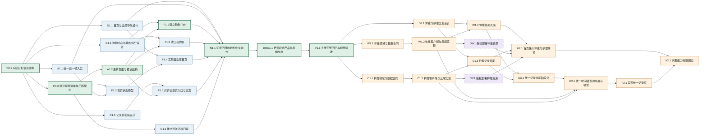

# 项目结构与界面编排 DAG 路线图

**状态：** 方向已确认，等待按 DAG 节点逐项设计与实施

**日期：** 2026-08-01

**当前实现基线：** 首页、记录、我的三个 Tab；“我的”同时承担账号与狗狗档案；首页可开始本餐并查看最近一顿；共享本餐创建、评估、保存和记录回看闭环已经建立。

**路线图优先级：**

1. 主线先整理现有项目结构、信息架构和界面编排，不以新增功能作为主线完成条件。
2. 体重趋势、疫苗和驱虫等护理记录放在主线完成后的次要能力支线。
3. 体重与护理可以并行开发；统一记录时间轴在二者稳定后再评估和实施。

## 1. 已确认的产品裁决

### 1.1 主导航

目标底部导航采用“四个目的地 + 一个中央动作”的结构：

```text
首页        记录        ＋        狗狗        我的
今日概览    历史回看    记一顿     档案中心    账号与设置
```

- 首页、记录、狗狗、我的是真正的 Tab 页面。
- 中央“＋”不是第五个目的地，不保留选中态，点击后直接开始或恢复一顿饭。
- “＋”只在一级 Tab 页面常驻；选狗、选菜单、编辑本餐和记录详情等任务型子页面不强行显示。
- 当前产品只服务狗，Tab 使用“狗狗”而不是更宽泛的“爱宠”。

### 1.2 页面职责

- **首页：** 回答“今天接下来做什么”，展示当前主任务、草稿、今天记录摘要和已有档案缺失事项。
- **记录：** 主线阶段继续负责本餐历史回看，不等待体重或护理记录才完成改版。
- **狗狗：** 管理狗狗列表、单狗概览和现有档案编辑入口。
- **我的：** 只保留账号、隐私、帮助、反馈和设置类低频能力；不再管理狗狗档案。
- **中央加号：** 统一复用现有登录、建档、选狗、草稿恢复和选菜单流程，不建立第二套判断。

### 1.3 首页第一版数据边界

主线首页只消费当前已经存在的数据：

- 登录状态；
- 狗狗档案及完整性/适用状态；
- 未完成的共享本餐草稿；
- 今天和最近一顿本餐记录；
- 数据读取失败状态。

体重过期、疫苗和驱虫到期等提醒不作为主线首页的前置条件。对应数据能力上线后，再通过次要支线接入首页。

### 1.4 次要能力边界

- **体重测量记录：** 每次称量形成不可变历史记录；最新有效测量同步为狗狗档案的当前体重，供未来新建本餐计算使用。
- **护理记录：** 记录疫苗、体内驱虫、体外驱虫和其他护理事实，可选填写用户自己确定的下次日期。
- **护理提醒：** 只根据用户填写的日期提示，不自动推导医疗周期、剂量或健康结论。
- **统一记录时间轴：** 属于后续增强；主线“记录”页可以先继续只展示本餐记录。

### 1.5 本路线图不做

- 不删除旧食谱、批量清单页面或历史数据。
- 不重做已经稳定的选狗、选菜单、克重编辑、双轴评估和本餐详情业务。
- 不新增自动配餐、长期营养完整性判断、医疗建议或自动疫苗/驱虫周期。
- 不把体重、护理或统一时间轴变成主导航改版的阻塞项。
- 不在未取得单独授权时部署云函数、创建集合/索引、迁移线上数据、提交或推送 Git。

## 2. DAG 总览

图例：绿色为主线关键路径，蓝色为可并行的主线工作，橙色为主线完成后启动的次要能力，紫色为需要单独授权的云端操作。



## 3. 如何并行执行

### 3.1 主线并行批次

| 批次 | 可同时进行 | 汇合条件 |
| --- | --- | --- |
| Wave 0 | `P0.1` | 目标信息架构获得确认 |
| Wave 1 | `P0.2`、`D1.1`、`D1.2`、`D1.3`、`A1.1` | 现状迁移契约和三组设计均清楚 |
| Wave 2 | `A1.2`、`G1.1`、`F1.3` | 页面落点、机器门禁和首页纯状态模型完成 |
| Wave 3 | `F1.1`、`F1.2`、`F1.4`、`F1.5` | 四个一级页面都可独立验收 |
| Wave 4 | `N1.1` | 所有主 Tab 已存在且入口一致，才切换全局导航 |
| Wave 5 | `DOC1.1` → `V1.1` | 文档与实现一致后进行主线总验收 |

Wave 1 和 Wave 3 是本路线图最主要的并行窗口。`N1.1` 是主线汇合点，不能因为某一个页面已完成就提前切换全局导航。

### 3.2 次要能力并行批次

主线 `V1.1` 完成后：

```text
体重：W1.1 → W1.2 → W1.3 → OW1 ┐
                                      ├→ H2.1 首页事项
护理：C1.1 → C1.2 → C1.3 → OC1 ┘

W1.3 + C1.3 → D3.1 → R2.1 → F2.1 → V2.1
```

- 体重和护理没有相互业务依赖，可以并行。
- 两条支线应使用独立模块、云函数和集合，避免同时修改同一个大 adapter 文件。
- `OW1` 与 `OC1` 是外部状态变更，必须分别取得授权；代码完成不等于已部署。
- 首页事项和统一记录页是汇合节点，不能先于两类数据的稳定读取能力完成。

## 4. 主线任务明细

### P0：规格与迁移基线

#### P0.1 冻结目标信息架构

**范围：** 产品文档和页面职责，不改代码。

**产出：**

- 确认“首页、记录、狗狗、我的 + 中央记一顿”的导航模型。
- 冻结首页、记录、狗狗、我的和中央动作的职责。
- 明确主线只重排现有能力，体重和护理属于后续支线。
- 明确旧食谱与批量页面继续兼容保留。

**验收：** 目标页面树、入口矩阵、游客/无档案/单狗/多狗状态无冲突。

#### P0.2 建立现状清单与迁移契约

**依赖：** `P0.1`

**范围：** 只读审计、迁移清单和机器可读导航契约。

**产出：**

- 盘点 `app.json`、`custom-tab-bar`、主包页面、分包页面和导航服务。
- 标记保留、迁移、新增、兼容四类页面。
- 列出页面到 service、adapter、云函数的当前依赖，禁止通过 UI 重排复制业务逻辑。
- 固定旧深链兼容和回滚路径。

**验收：** 每个目标 Tab 都有唯一 canonical 页面；每个旧入口都有明确处理方式。

### D1：先行界面设计

#### D1.1 首页与全局导航设计

**依赖：** `P0.1`

**范围：** Figma 和交接文档，不改小程序页面。

**必须覆盖：**

- 中央加号的默认、按下、无障碍和安全区状态；
- 首页游客、无档案、有草稿、今天无记录、今天有记录、数据失败状态；
- 320pt 与 375/390pt 宽度；
- 长狗名、多个狗狗、长菜单名和底部 TabBar 遮挡检查。

#### D1.2 狗狗中心与我的拆分设计

**依赖：** `P0.1`

**范围：** 狗狗列表、单狗概览和精简后的“我的”；不提前设计体重趋势和护理详情。

**验收：** 登录、未登录、无狗、多狗、档案完整/不完整/不适用状态均有明确归属。

#### D1.3 记录页衔接设计

**依赖：** `P0.1`

**范围：** 只确认现有本餐记录页在新导航中的标题、空态入口和返回关系；不把统一时间轴提前塞入主线。

### A1/G1：结构与门禁

#### A1.1 统一“记一顿”入口

**依赖：** `P0.1`

**范围：** 建立一个稳定入口供首页、记录空态和中央加号复用。

**行为：**

- 未登录进入登录；
- 无档案进入建档；
- 已有草稿进入现有恢复决策；
- 单狗和多狗继续使用当前选狗规则；
- 不在调用方复制资格与草稿判断。

**验收：** 三个调用入口得到相同结果，取消或返回不清除草稿。

#### A1.2 重排页面与模块结构

**依赖：** `P0.2`

**范围：** 建立狗狗 Tab canonical 页面，整理页面目录和共享模块落点；暂不切换 TabBar。

**原因：** 先让新页面可单独访问和测试，再修改全局导航，降低回滚范围。

**验收：** 主包边界、分包引用和旧深链检查通过；不存在重复业务页面。

#### G1.1 建立导航迁移门禁

**依赖：** `P0.2`

**范围：** 更新或新增导航静态检查和正反测试。

**门禁至少检查：**

- `app.json` 与自定义 TabBar 的四个真实目的地一致；
- 中央加号不被当作选中 Tab；
- 首页、记录空态和加号复用统一记餐入口；
- 狗狗档案不再由“我的”承担；
- 旧兼容页仍注册但不暴露为主入口。

### F1/N1：页面实施与导航汇合

#### F1.1 建立狗狗 Tab

**依赖：** `D1.2`、`A1.2`

**范围：** 新建狗狗列表/概览主页面，复用现有狗狗数据和编辑分包。

**不包含：** 不实现体重曲线、疫苗或驱虫记录。

#### F1.2 收口“我的”页

**依赖：** `D1.2`、`A1.2`

**范围：** 移除狗狗档案列表，保留账号与真实可用的设置/帮助入口；不添加占位菜单。

#### F1.3 首页状态模型

**依赖：** `P0.2`、`A1.1`

**范围：** 纯状态与展示模型，不改 WXML/WXSS。

**输入：** 登录态、档案、适用状态、草稿、今天记录和最近记录。

**输出：** 唯一主任务、今天摘要、最多三条现有档案事项和稳定错误降级。

#### F1.4 实现自适应首页

**依赖：** `D1.1`、`F1.3`

**范围：** 按确认设计实现首页；不加入体重和护理假数据。

#### F1.5 对齐记录页入口与文案

**依赖：** `D1.3`、`A1.2`

**范围：** 只修改新导航需要的标题、空态和统一记餐入口；保留现有本餐日历与详情模型。

#### N1.1 切换四目的地加中央动作

**依赖：** `D1.1`、`A1.1`、`F1.1`、`F1.2`、`F1.4`、`F1.5`、`G1.1`

**范围：** 最后修改 `app.json`、`custom-tab-bar` 和 Tab 图标资源。

**验收：**

- 四个 Tab 的选中态、返回栈和刷新行为正确；
- 中央加号不切换选中 Tab，直接进入统一记餐入口；
- 刘海屏、底部安全区、320pt 窄屏和大字体不遮挡；
- 任务型子页面不出现重复 TabBar 或悬浮加号。

### DOC1/V1：主线交付

#### DOC1.1 更新权威产品与架构文档

**依赖：** `N1.1`

**范围：** 更新基础功能、产品设计、架构、数据库入口、UI 交接和文档索引；把旧三 Tab 描述移入迁移历史。

#### V1.1 主线完整回归与视觉验收

**依赖：** `DOC1.1`

**自动检查：**

- `npm test`
- `npm run check:ui`
- `npm run check:main-package`
- `npm run check:shared-meal-navigation`
- 新导航迁移门禁
- `git diff --check`

**开发者工具路径：**

- 游客首页 → 登录 → 建档 → 回到原记餐意图；
- 单狗、多狗、有草稿和失效草稿的中央加号流程；
- 首页 → 记录、首页 → 狗狗、狗狗 → 编辑档案、我的账号状态；
- 记录空态 → 记一顿；
- 旧食谱和批量深链仍可兼容访问；
- 320pt、375pt/390pt、安全区、长文案和长列表视觉比对。

## 5. 次要能力任务明细

以下任务全部依赖主线 `V1.1`，不会阻塞结构和界面编排交付。

### D2：体重与护理设计

#### D2.1 体重与护理交互设计

**范围：** 单狗概览中的入口、体重历史/趋势、护理列表、添加与编辑状态。

**边界：** 不设计自动医疗周期、剂量建议、健康诊断或复杂病历。

### W1：体重支线

#### W1.1 体重领域与数据合同

**产出：** 当前体重、体重测量记录、最新有效记录、删除最新记录后的回退规则，以及现有 `weightKg` 的迁移策略。

#### W1.2 体重客户端与云端实现

**依赖：** `W1.1`

**范围：** 独立体重模块、adapter、云函数、集合 schema、索引和测试；不改页面。

#### W1.3 体重趋势页面

**依赖：** `D2.1`、`W1.2`

**验收：** 新增、修改/删除策略、空态、长历史、趋势展示和最新体重同步。

#### OW1 授权部署体重资源

**依赖：** `W1.2`

**要求：** 云函数、集合/索引、历史体重初始化和烟测分别按授权范围执行；不自动迁移线上数据。

### C1：护理支线

#### C1.1 护理领域与数据合同

**产出：** 疫苗、体内驱虫、体外驱虫、其他护理四类事实记录；发生日期、可选名称、可选下次日期和备注。

#### C1.2 护理客户端与云端实现

**依赖：** `C1.1`

**范围：** 独立护理模块、adapter、云函数、集合 schema、索引和测试；不自动推导日期。

#### C1.3 护理记录页面

**依赖：** `D2.1`、`C1.2`

**验收：** 分类筛选、添加、编辑、删除确认、空态、长备注和用户填写的下次日期。

#### OC1 授权部署护理资源

**依赖：** `C1.2`

**要求：** 与体重资源独立授权、独立部署和独立回滚。

### H2/R2：次要能力汇合

#### H2.1 首页接入体重与护理事项

**依赖：** `W1.3`、`C1.3`、`OW1`、`OC1`

**范围：** 扩展首页事项来源，不重做首页结构。

**规则：**

- 只显示真实记录和用户填写的日期；
- 体重只表达“上次记录于多久前”，不自动判定健康异常；
- 护理事项不表达系统推荐周期；
- 最多展示三条，允许进入对应狗狗和记录页。

#### D3.1 统一记录时间轴设计

**依赖：** `W1.3`、`C1.3`

**范围：** 评估是否将记录页升级为“全部/吃饭/体重/护理”，并冻结月历标记、筛选、多狗和详情跳转。

#### R2.1 统一时间轴查询与展示模型

**依赖：** `D3.1`、`W1.2`、`C1.2`

**范围：** 聚合三种独立记录的只读结果；不把三种写模型合并为一个万能记录集合。

#### F2.1 实现统一记录页

**依赖：** `R2.1`

**范围：** 在确认设计后改造记录页，保留本餐快照详情和各类记录自己的详情入口。

#### V2.1 次要能力完整回归

**依赖：** `H2.1`、`F2.1`

**验收：** 权限隔离、分页、时区、删除/更新一致性、首页事项、三类记录筛选、云端烟测和视觉状态全部通过。

## 6. 共享写面与并行冲突规则

逻辑上无依赖不等于可以安全同时修改。并行实施时遵守以下规则：

| 共享资源 | 规则 |
| --- | --- |
| `app.json`、`custom-tab-bar/**` | 只由 `N1.1` 最终修改；其他节点不得提前切换导航 |
| `pages/home/**` | `F1.4` 主线实现结束后，`H2.1` 才能扩展 |
| `pages/profile/**` | 只由 `F1.2` 收口；狗狗页面使用新的 canonical 路径 |
| `pages/records/**` | `F1.5` 只做主线衔接，`F2.1` 后续再做统一时间轴 |
| adapter | 体重与护理使用独立 adapter 模块，避免并行修改单个集中式文件 |
| 云环境 | 体重和护理使用独立云函数、集合和索引；每次部署单独授权 |
| 权威文档 | 主线由 `DOC1.1` 汇总；次要能力完成后再追加，不提前写成已上线事实 |

## 7. 里程碑与完成定义

### M1：结构与界面编排完成

- 四个真实 Tab 和中央记餐动作可用。
- 狗狗档案从“我的”迁入独立狗狗中心。
- 首页按现有数据自适应，不依赖未开发功能。
- 记录页继续稳定回看本餐。
- 旧兼容页面仍可访问，但不暴露为主入口。
- 产品、设计、架构和实现描述一致。

### M2：体重与护理可用

- 体重形成历史趋势，最新值与档案当前体重一致。
- 疫苗和驱虫作为事实记录保存，可选用户填写下次日期。
- 两条支线权限隔离、失败恢复和云端部署均独立验收。

### M3：首页事项与统一时间轴完成

- 首页可以显示真实的体重和护理事项，但不制造健康或医疗结论。
- 记录页可以按吃饭、体重、护理筛选和回看。
- 三种记录保持独立写模型，只在查询和展示层汇合。

## 8. 进度看板

**主线进度：** 4 / 16

**次要能力进度：** 0 / 14

### 主线

- [x] `P0.1` 冻结目标信息架构（见 [`目标信息架构冻结`](../specs/2026-08-01-target-information-architecture.md)）
- [x] `P0.2` 建立现状清单与迁移契约（见 [`现状清单与导航迁移契约`](../specs/2026-08-01-current-structure-and-navigation-migration-contract.md)）
- [x] `D1.1` 首页与全局导航设计（见 [`首页与全局导航设计交接`](../specs/2026-08-01-home-and-global-navigation-design.md)）
- [ ] `D1.2` 狗狗中心与我的拆分设计
- [ ] `D1.3` 记录页衔接设计
- [x] `A1.1` 统一“记一顿”入口
- [ ] `A1.2` 重排页面与模块结构
- [ ] `G1.1` 建立导航迁移门禁
- [ ] `F1.1` 建立狗狗 Tab
- [ ] `F1.2` 收口“我的”页
- [ ] `F1.3` 首页状态模型
- [ ] `F1.4` 实现自适应首页
- [ ] `F1.5` 对齐记录页入口与文案
- [ ] `N1.1` 切换四目的地加中央动作
- [ ] `DOC1.1` 更新权威产品与架构文档
- [ ] `V1.1` 主线完整回归与视觉验收

### 次要能力

- [ ] `D2.1` 体重与护理交互设计
- [ ] `W1.1` 体重领域与数据合同
- [ ] `W1.2` 体重客户端与云端实现
- [ ] `W1.3` 体重趋势页面
- [ ] `OW1` 授权部署体重资源
- [ ] `C1.1` 护理领域与数据合同
- [ ] `C1.2` 护理客户端与云端实现
- [ ] `C1.3` 护理记录页面
- [ ] `OC1` 授权部署护理资源
- [ ] `H2.1` 首页接入体重与护理事项
- [ ] `D3.1` 统一记录时间轴设计
- [ ] `R2.1` 统一时间轴查询与展示模型
- [ ] `F2.1` 实现统一记录页
- [ ] `V2.1` 次要能力完整回归

维护规则沿用现有实施计划：只有满足任务全部验收条件才勾选；UI 任务必须先有确认设计；云端操作必须单独授权；每个任务完成后追加当日工作日志；Git 提交继续逐次取得用户允许。
