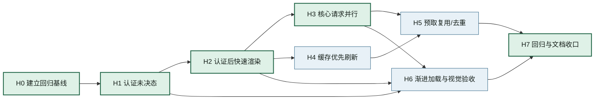

# 首页启动体验优化实施路线图

**状态：** 已完成（H0–H7 均已实施并通过验收）

**日期：** 2026-08-09

**目标：** 消除首页冷启动时“微信未登录/登录并继续”的错误闪现，并缩短用户看到可用首页内容的时间。

**上游：** [`首页与全局导航设计交接`](../specs/2026-08-01-home-and-global-navigation-design.md)、[`首页体重与护理事项实施交接`](../specs/2026-08-05-home-item-implementation.md)

## 1. 现状诊断与设计裁决

### 1.1 已确认的现象

首页初始 `data` 和全局 `globalData` 都把认证状态设为 `guest`。页面首帧会先按游客状态渲染，`onShow` 随后等待 `authReady`，再依次读取狗狗、记录和首页事项，最后一次性 `setData`。

因此，登录用户在认证和数据读取期间会看到游客文案；等待时间实际还包含首页数据请求，不应把全部延迟归因于微信登录。

### 1.2 保留的产品边界

- `guest` 只表示认证已经完成且确认没有登录，不表示“认证未知”。
- 首页六类业务状态继续由 `homeStateModel` 负责；新增的是启动生命周期状态，不重写主任务规则。
- 数据失败不阻断“记一顿”入口；部分数据可独立降级。
- 不新增云端集合、云函数或登录协议；先优化客户端状态和请求编排。
- 不把体重/护理事项提升为首页首屏阻塞条件。

### 1.3 推荐的启动状态

```text
initializing
    └─认证完成→ guest
             ├→ logged-in
             └→ has-profile

logged-in / has-profile
    └─数据读取→ ready 或 partial/error
```

`authState` 和 `loadStatus` 是两个独立维度：前者表达用户身份，后者表达首页数据是否已准备好。页面不得通过 `authState === 'guest'` 推断“仍在初始化”。

## 2. 目标接口与模块边界

### 2.1 首页启动协调模块

建议把首页的请求编排收口到一个深模块（可先放在 `pages/home/index.js` 的纯函数，稳定后再抽到 `services/homeStartupService.js`）：

```js
createHomeStartupCoordinator({
  authReady,
  getCachedAuth,
  listDogs,
  listRecords,
  listHomeItems,
  getDraftSummary
})
```

对页面只暴露少量结果：

```js
{ phase, authState, dogs, todayRecords, recentRecords, homeItems, errors }
```

请求并行、缓存优先、错误隔离和竞态取消都属于该模块的实现细节；首页只消费阶段性结果并渲染。

### 2.2 数据来源责任

| 数据 | 首屏来源 | 后台刷新 | 失败处理 |
| --- | --- | --- | --- |
| 认证状态 | `authReady` 结果 | `refreshAuthState` | 显示确认后的游客或认证错误 |
| 狗狗档案 | `globalData.dogs` / `dogsCache` | `dogService.listDogs()` | 使用缓存，标记档案读取失败 |
| 本餐记录 | 可复用预取/短缓存 | `sharedMealRecordService.list()` | 只降级记录区 |
| 体重/护理事项 | 不阻塞首屏 | `homeItemService.listForDogs()` | 只隐藏或降级事项区 |
| 草稿摘要 | 本地同步读取 | 无需远端刷新 | 无草稿即可 |

## 3. 任务分解

### H0：建立启动体验回归基线

**依赖：** 无

**范围：** 先写测试/测量，不改业务实现。

**产出：**

- 首页首帧认证未决测试：不会显示游客主任务；
- 认证完成后主任务显示测试；
- 记录请求延迟下的阶段性渲染测试；
- 记录冷启动关键时间点：`page-created`、`auth-ready`、`shell-ready`、`home-ready`。

**验收：** 测试能稳定复现当前首帧 `guest` 问题，并能在修复后转绿。

**完成/验收：** 已新增首页首帧、认证后主任务、慢记录阶段渲染和四个启动时间点的回归基线；相关测试已随 H1/H2 实现转绿。提交：`79c0b40`。

### H1：认证未决态与首页加载态

**依赖：** `H0`

**改动：** `homeStateModel` 增加启动态或等价的 `loadStatus`；首页初始数据改为 `initializing`；WXML 使用中性加载态。

**不改：** 游客、无档案、今天有记录等既有业务状态的文案和主任务规则。

**验收：** 认证 Promise 未完成时不出现“登录并继续”“登录后查看最近记录”等游客文案；认证完成为游客后仍正确显示游客态。

**完成/验收：** 首页初始认证状态改为 `unknown`，使用 `initializing` 中性加载态；认证完成为游客后才进入既有游客态。页面与状态模型测试通过。提交：`5be8aec`。

### H2：认证后快速渲染首页外壳

**依赖：** `H1`

**改动：** `authReady` 完成后立即使用 `globalData` 和缓存中的认证/狗狗信息构建首页主任务；草稿摘要同步注入；远端数据使用增量更新。

**验收：** 已登录用户在记录接口尚未返回时，首屏已显示正确的“记一顿/完善档案”主任务，不显示游客内容。

**完成/验收：** 认证完成后立即消费全局认证/狗狗快照和本地草稿摘要，远端记录挂起时仍能先显示正确主任务。首页与认证快路径契约测试通过。提交：`ef88f9c`。

### H3：并行化首页核心读取

**依赖：** `H2`

**改动：** 狗狗档案和本餐记录使用 `Promise.allSettled` 并行；狗狗返回后再加载体重/护理事项；保留分项错误映射和请求 token 竞态保护。

**验收：** 单次首页加载中狗狗和记录请求重叠；任一请求失败不阻塞另一块内容；无重复 `setData` 覆盖较新的 `onShow` 结果。

**完成/验收：** 狗狗档案和本餐记录已通过 `Promise.allSettled` 并行读取，保留分项错误与请求 token；并行、单项失败和连续 `onShow` 竞态测试通过。提交：`e707d60`。

### H4：缓存优先与后台刷新

**依赖：** `H2`，可与 `H3` 并行开发

**改动：** 复用 `authService.initAuth()` 已读出的 `dogsCache`；定义缓存版本、过期和远端刷新覆盖规则；缓存只作为展示快照，不改变服务端事实。

**验收：** 有有效缓存时可在无网络或慢网络下显示稳定主任务；远端成功返回后更新缓存和页面；旧 schema 缓存不会被误用。

**完成/验收：** `dogsCache/v3` 的版本、结构和有效期校验已集中到档案契约；远端成功覆盖缓存，失败保留有效展示快照，旧版或过期缓存会被拒绝。相关缓存往返测试通过。提交：`e707d60`。

### H5：启动预取复用与请求去重

**依赖：** `H3`，可与 `H4` 并行设计

**改动：** 盘点 `app.js` 的记录时间轴预取与首页读取重叠；优先增加共享 in-flight Promise 或结果适配器；若复用成本过高，则把完整时间轴预取延后到首页稳定后/记录页即将进入时。

**验收：** 冷启动不会同时发起两套等价的狗狗/本餐读取；记录页仍能获得完整时间轴；预取失败不影响首页主任务。

**完成/验收：** 狗狗档案并发读取复用共享 in-flight Promise；记录时间轴预取延后到当前事件循环空闲后启动且失败隔离。并发去重与小程序运行时测试通过。提交：`d55261e`。

### H6：渐进式区域加载与视觉验收

**依赖：** `H1`、`H2`、`H3`

**改动：** 主任务、今日摘要、最近一顿、体重/护理事项分区独立进入 ready/empty/error；加载态使用现有 UI Kernel 和设计 token，不新增基础组件。

**验收：** 320/375/390pt 下无布局跳动、文字重叠或底部导航遮挡；加载、空、错误、长文案状态均通过截图或真机检查。

**完成/验收：** 今日摘要、最近一顿、体重/护理事项已具备独立 loading/empty/error 表达，并以最小高度和既有安全区约束稳定布局；静态结构测试与 UI 检查通过。2026-08-09 已由人工确认 320/375/390pt、加载/空/错误/长文案及底部安全区视觉验收通过。提交：`d55261e`。

### H7：回归、监测与文档收口

**依赖：** `H3`、`H4`、`H5`、`H6`

**产出：** 更新首页测试、UI 检查记录、性能测量说明和本路线图状态；移除临时调试日志。

**验收：** 定向测试、UI 静态检查、主包检查和项目导航检查通过；全量测试的既有失败与本次结果分开记录。

**完成/验收：** 已完成回归与文档收口，未保留临时调试日志。定向测试 74/74 通过，UI 静态检查、主包检查和项目导航检查均通过；全量测试共 475 项，472 项通过、1 项跳过、2 项既有失败，失败分别来自菜单页旧样式断言和记录页旧空态文案断言，与本路线图改动无关。

## 4. DAG 总览



## 5. 并行实施批次

| 批次 | 可并行任务 | 汇合条件 |
| --- | --- | --- |
| Wave 0 | `H0` | 有能复现首帧闪烁的回归基线 |
| Wave 1 | `H1` | 启动态与游客态可被测试区分 |
| Wave 2 | `H2` | 已登录用户能先看到正确主任务 |
| Wave 3 | `H3`、`H4` | 核心请求并行、缓存契约和刷新规则完成 |
| Wave 4 | `H5`、`H6` | 预取策略确定，分区加载视觉稳定 |
| Wave 5 | `H7` | 全部测试和文档收口 |

`H3` 与 `H4` 可以由不同开发者并行；`H5` 需要同时查看两者的结果，但可先独立完成请求重叠审计。`H6` 可以在 `H1` 完成后先做静态 UI 骨架，待 `H3` 完成后接入真实阶段状态。

## 6. 实施顺序与回滚策略

推荐先交付 `H0 → H1 → H2` 作为第一期。这一期就能消除错误登录提示，并让已登录用户更快看到主任务。随后交付 `H3/H4` 降低等待时间，最后处理 `H5/H6` 的跨页面复用和视觉收口。

每一步都保持可回滚：

- `H1/H2` 只增加状态字段和阶段性 `setData`，保留原业务状态模型；
- `H3` 保留原串行实现作为失败降级路径，必要时可切回；
- `H4` 缓存只影响首屏读取，不改变云端数据；
- `H5` 不删除记录页现有查询，复用失败时回退独立读取；
- `H6` 不修改导航和页面职责。

## 7. 验证命令与手动清单

定向测试建议：

```bash
node --test tests/home-page.test.js tests/home-state-model.test.js tests/miniapp-runtime.test.js
npm run check:ui
npm run check:main-package
npm run check:project-navigation
```

手动验证至少覆盖：

- 有 token、有狗狗缓存、慢记录接口；
- 有 token、无缓存、慢网络；
- 无 token 的真实游客；
- 记录读取失败但首页主任务仍可点击；
- 连续进入/离开首页时旧请求不能覆盖新状态；
- 320/375/390pt、长狗名和底部安全区。

### 7.1 启动关键时间点测量说明

`services/homeStartupTiming.js` 使用可注入时钟记录单次冷启动的首次时间点，默认不输出控制台日志；重复 `onShow` 或重试不会覆盖已记录值。各时间点口径如下：

| 时间点 | 记录时机 | 用途 |
| --- | --- | --- |
| `page-created` | 首页模块创建并初始化记录器后 | 冷启动相对耗时起点 |
| `auth-ready` | `app.globalData.authReady` 完成后 | 区分认证等待耗时 |
| `shell-ready` | 认证快照、狗狗缓存和草稿已写入首页外壳后 | 衡量用户看到正确主任务的时间 |
| `home-ready` | 狗狗、记录和事项阶段结果完成并写入页面后 | 衡量首页完整数据就绪时间 |

推荐关注 `page-created → shell-ready` 作为可操作首屏指标，使用 `auth-ready → shell-ready` 观察认证后渲染开销，并将 `shell-ready → home-ready` 视为后台数据补全时间。测试中的 `0/40/65/200ms` 是注入时钟的计算样例，只验证记录器与阶段差值，不代表开发者工具或真机实测结果；需要比较设备性能时，应在同一设备、同一网络和相同缓存条件下多次冷启动采样，并分别记录有缓存、无缓存与慢网络场景。

## 8. 暂不纳入本路线图

- 修改微信登录云函数或登录协议；
- 建立全局离线数据库；
- 为首页引入新的第三方 UI 组件；
- 通过启动预取自动推导健康、营养或护理结论；
- 未经授权的线上部署、数据迁移、Git 提交或推送。
